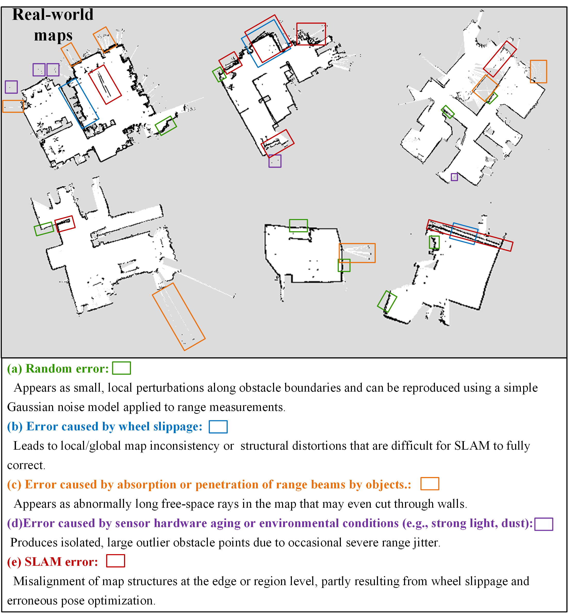
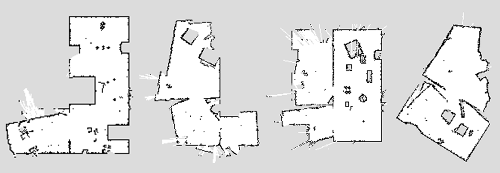
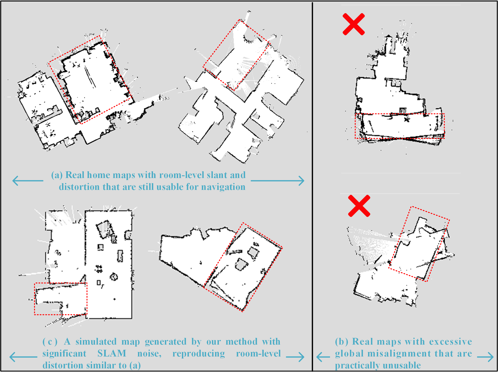
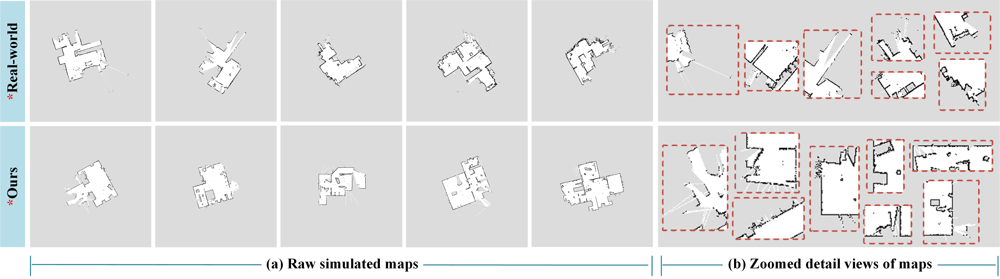
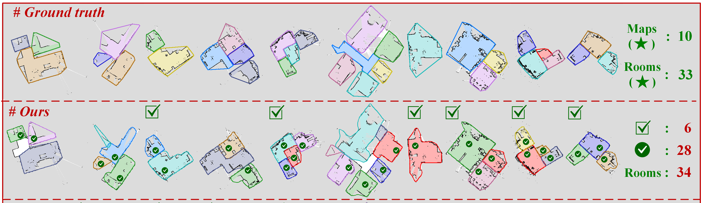

# Robust Room Contour Extraction from 2D Home Metric Maps under Cluttered Layouts and Map Noise for Domestic Robots 

This document provides comprehensive execution guidelines for our code. To enable the flexible application of different parts in our proposed method, our code is modularly organized into three independent units: (1) map generation (incorporating room contour inference), (2) floor plan annotation (i.e.,  basic boundary generation only), and (3) room contour extraction. Subsequent sections detail the installation and execution procedures for each unit. 

Room area extraction from occupancy grid maps of home environments is critical for enabling robotic room-level spatial awareness of environmental structures, serving as a foundation for semantic-aware navigation and decision-making. However, most existing methods rely on geometric heuristics derived from human abstraction, which tend to exhibit unstable performance across maps with heterogeneous home layouts and significant noise. Learning-based approaches offer the potential to capture generalizable room features beyond the reach of human abstraction, but their application on grid maps is severely limited by the scarcity of real-world map data. To address this, we propose a simulation-based learning framework for the accurate and robust extraction of room contours from real-world home grid maps in the presence of cluttered home layouts and map noise. Specifically, we propose a realistic simulation method to generate a large-scale synthetic grid map dataset by simulating diverse household obstacle layouts, introducing multi-source mapping uncertainties, and replicating mapping traces using a reinforcement learning-based exploration controller. In addition, we propose an efficient semi-automatic annotation method to produce high-precision room contours for the extensive simulated maps. A deep learning network is employed to learn room features and predict room contours. Experimental results on real-world home maps demonstrate that our method extracts more accurate and complete room areas than existing state-of-the-art methods and facilitates room-related robotic applications.

Through rigorous testing, we have verified stable long-term operation of our code on our PC (*GPU: 3×NVIDIA RTX 2080 Ti; CPU: Intel Core i9-9960X; OS: Ubuntu 18.04.6 LTS*). Note that platform-specific adjustments may be required for incompatible hardware/software configurations. 

## 1 Home Map Generation

### 1.1 Prerequisite&Installation

* Our code has been tested under: 

  * python==3.6
  * tensorflow==1.15
  * numpy == 1.19.5
  * pyyaml ==5.4.1
  * gym==0.15.7
  * opencv-python==4.5.4.58
  * matplotlib==3.3.4
  * shapely==1.6.4
  * ***cuda*** == 10.0; ***cudnn***==7.5.0.56

* **Install  dependences**

  ```bash
  cd Home_map_generation
  cd python_env
  conda env create -f generation.yaml
  conda activate generation
  pip install -r generation.txt
  ```

* **Install  package**

  ```bash
  #Before installation, please delete the two folders, 'generation.egg-info' and 'baselines.egg-info', if they already exist.
  cd Home_map_generation
  conda activate generation
  pip install -e .
  cd baselines
  pip install -e .
  ```

* **Gym configuration**

  Please add our environments to Gym  by registering in `*/envs/generation/lib/python3.6/site-packages/gym/envs/__init__.py` (i.e., the installation path of Gym in your python environment):

  ```python
  register(
      id='RobotExploration-v3',
      entry_point='generator.envs.Room_Segmentation_Generation:RobotExplorationT0',
      max_episode_steps=1000,
  )
  register(
      id='RobotExploration-v302',
      entry_point='generator.envs.Room_Segmentation_GenerationV2:RobotExplorationT0',
      max_episode_steps=1500,
  )
  ```

* **Model download**

  The trained model weights for the RL-based exploration controller in the map generation module are available for download via [Google Drive](https://drive.google.com/file/d/1MSm3KWz8G47p4D6piHJA3l1aFUXnuaNH/view?usp=sharing). After downloading, simply place the parameter file into the designated folder`RRCE_2D\Home_map_generation\RL_models`.

### 1.2 Running in a terminal

To streamline deployment and enable rapid demonstration, our program generates varied maps based on three annotated floor plans (in `input_data`). Through this pipeline, we ultimately generate a comprehensive training dataset comprising 30,000 maps using 3000 floor plans.

The program generates maps continuously until manual termination of the program.

```bash
cd Home_map_generation
conda activate generation
```

* Generate maps with exploration controller 1

  ```bash
  python -m baselines.run --alg=ppo2 --env=RobotExploration-v3 --network=cnn --num_timesteps=0 --load_path=./RL_models/97000 --play
  ```

* Generate maps with exploration controller 2

  ```bash
  python -m baselines.run --alg=ppo2 --env=RobotExploration-v302 --network=cnn --num_timesteps=0 --load_path=./RL_models/10400 --play
  ```

### 1.3 Map Generation Results

Fig. 1 illustrates the visual style of real-world maps and the main sources of noise. Our map generation method aims to reproduce, as faithfully as possible, the diverse geometric noise patterns, mapping noise, object layouts, and mapping (SLAM)-induced artifacts observed in real maps. The resulting simulated maps are shown in Fig. 2, from which it can be seen that our generated maps closely match the style of real-world maps. Fig. 4 provides a comparison between our simulated maps and real maps in terms of overall appearance and structural details, while Fig. 3 presents a comparison with a focus on global noise characteristics.



​                                                  Fig. 1. Representative noise patterns observed in real occupancy grid maps.



​                                              Fig.2. Examples of final noisy home occupancy maps generated by the proposed simulation pipeline.



​                                            Fig.3. Examples of global distortion in real and simulated home maps.



Fig.4. Visual comparison of real and simulated maps. (a) Comparison of raw simulated maps. All maps are configured with a resolution of 0.05 $m/pixel$ and normalized by aligning their centers and sizes to ensure consistency across comparisons. (b) Comparison of zoomed detail views in different maps.

## 2 Floor Plan Annotation

### 2.1 Prerequisite&Installation

* **Install  dependences**

  ```bash
  cd Floor_plan_annotation
  cd python_env
  conda env create -f annotation.yaml
  conda activate annotation
  pip install -r annotation.txt
  ```

### 2.2 Running in a terminal

To streamline deployment and facilitate rapid demonstration, we provide three  three floor plans for users to label room basic boundaries.

The operational workflow of our labeling software is demonstrated in the video tutorial located at `Floor_plan_annotation/Annotation_Demo_video.mp4`.

```bash
cd Floor_plan_annotation
conda activate annotation
python room_annotion_v4.py
```

## 3 Room Contour Extraction

### 3.1 Prerequisite&Installation

* Our code has been tested under: 
  * python==3.7
  * numpy==1.21.4
  * opencv-python==3.4.2.17
  * cython==0.28.2
  * torch==1.1.0
  * ***cuda*** == 10.0; ***cudnn***==7.5.0.56

* **Install  dependences**

  ```bash
  cd Room_contour_extraction
  cd python_env
  conda env create -f room_extraction.yaml
  conda activate room_extraction
  pip install -r room_extraction.txt
  pip install https://download.pytorch.org/whl/cu100/torch-1.1.0-cp37-cp37m-linux_x86_64.whl
  
  #Before installation, please delete the folder, 'apex.egg-info' and 'build', if they already exist.
  cd Room_contour_extraction
  cd apex
  python setup.py install --cuda_ext --cpp_ext
  
  cd Room_contour_extraction
  cd lib/csrc
  cd dcn_v2
  python setup.py build_ext --inplace
  cd ../extreme_utils
  python setup.py build_ext --inplace
  cd ../roi_align_layer
  python setup.py build_ext --inplace
  ```

  **Notice:**

  **(1) If you encounter running issues of *Torch*, please find a available version of torch-1.1.0  with your cuda in `https://pytorch.org/get-started/previous-versions/`.**

  **(2) If you encounter installation issues of *Apex* , please find a available version in `https://github.com/NVIDIA/apex.git`.** 
  
* **Model download**

  The trained model weights for the room contour extraction network are also available for download via [Google Drive](https://drive.google.com/file/d/1MSm3KWz8G47p4D6piHJA3l1aFUXnuaNH/view?usp=sharing). After downloading, simply place the parameter file into the designated folder `RRCE_2D\Room_contour_extraction\data\model\room_contour`.

### 3.2 Running in a terminal

Executing the program with the following commands will perform room contour extraction on real-world home maps within folder `Maps_demo` and output results to the folder `Room_contour_output`. All input home maps have undergone preprocessing comprising four key operations: (1) dimensional standardization, (2) pixel value normalization, (3) resolution unification, and (4) centroid alignment.

```bash
cd Room_contour_extraction
conda activate room_extraction
python run_sxy.py --type prediction --cfg_file configs/room_learner.yaml demo_path ./Maps_demo
```

### 3.3 Room-Region Extraction Examples on Real 2D Occupancy Grid Maps



Fig.5. Visualization of extracted rooms from real-world home maps using different methods. The colored shadings in the maps represent the extracted (i.e., predicted) free areas within rooms, while the darker-colored curves indicate the extracted contours of complete rooms that are expected to encompass both free and obstacle areas. The correctly extracted rooms (denoted as correct rooms) and the maps with perfect room extractions (denoted as correct maps) are marked with symbols. A map with perfect room extractions is defined as one in which all rooms are correctly extracted without false positives. Other cases are considered maps with imperfect room extractions. The total number of extracted rooms, the number of correct rooms, and the number of correct maps for each method are summarized in the figure. 
